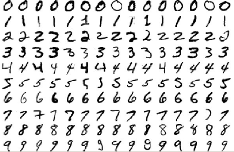
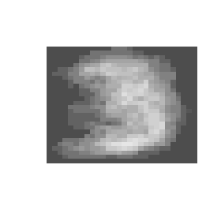
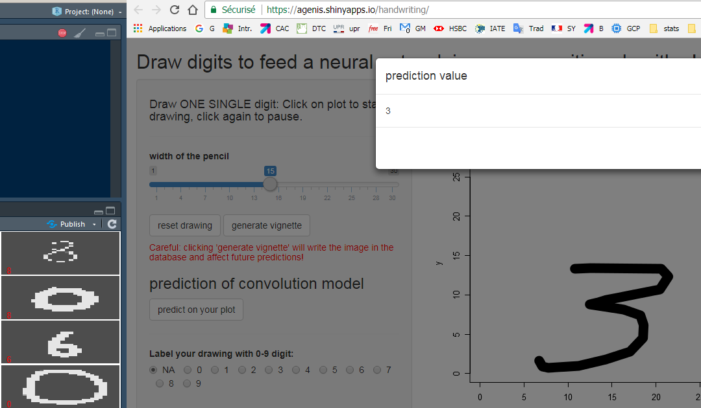
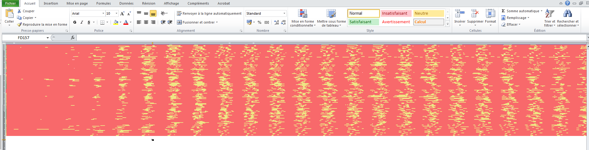

## Draw a digit on the screen and predict its class by Neural Network?

This project is inspired from the **famous [MNIST database](http://yann.lecun.com/exdb/mnist/) of handwritten digits** originally taken from scans of postal adresses on letters. This database, largely distributed among machine learning datascientists, allows to train neural networks to classify manually written digits and frequently reaching 99.5+% of accurary. It looks like this:

Few implementations in R have been documented, even fewer with Shiny (like, none). The novelty here, what I wanted to achieve is to allow a user to **self draw new digits on the screen** and compare with the algorithm's prediction. The algorithm would be trained on the MNIST dataset.

The first difficulty was to build an interface that allows free drawing with the mouse, given the constraints of Shiny. I achieved this using the *hoovering features* of a RenderPlot object, coupled with *click-events* to start and end the drawing. Since I did not designed a way to *smooth the manual shape*, I had to sample the mouse at a pretty high pace (100ms) to avoid brutal shapes. The speed of drawing indeed defines the smoothing aspect. 

The second difficulty concerned the dataset. The first neural network, inspired from [this tutorial](https://www.kaggle.com/dhinar1991/easy-neural-network-in-r-for-0-994) did a great job predicting MNIST images but failed dramatically when fed with mouse-drawn images. My **unsuccessful attempts** to solve this involved:
- modifying the parameters of the neural network
- changing the width of the line in the images
- using greyscale images instead of B&W to match the MNIST style
- applying a gaussian smoothing filter to add jpeg-like dégradé
- learning how to draw numbers the american way (especially the ones, the sevens, the fives..)

My hypothesis for this failure are the fact that the original image are too *calibrated* and different from what you draw with the mouse, in the sense that the NN might be too sensitive to the plot type, image format, American style figures, etc.

Eventually, I decided it was time to **create my OWN database**!, and I spend the night drawing up to **200 digits** with changes in the shape and width, stored them in a [google sheet](link here https://docs.google.com/spreadsheets/d/1Xj_bb3mxDCxTuf4KfRwarjJ-xV_z6m_90jI2ug8AXCU/) to which the Shiny application has read-and-write access, and trained again the NN from scratch. This time, it worked! I achieved **75% overall accuracy** (I don't need a F1 score because my classes are perfectly balanced) which is not bad at all for a start. 

However one difficulty couldn't be overcome: a solution to embed the neural network into the Shiny application (which is [online here](https://agenis.shinyapps.io/handwriting/)). The online app just allows you to draw, write the digit with its label into the database as a sequence of zeros and ones and import the database to show some funny images: this is the average result of every "3"-labeled image:

In order to predict, you will need to run the application in local, use the **mxnet** library, run previously some of the code in the *explo.R* script.

Here are some screencaptures:

This is how the images are encoded in Excel, columnn-binding the 28 "rows" of the image:

Thanks for reading!

